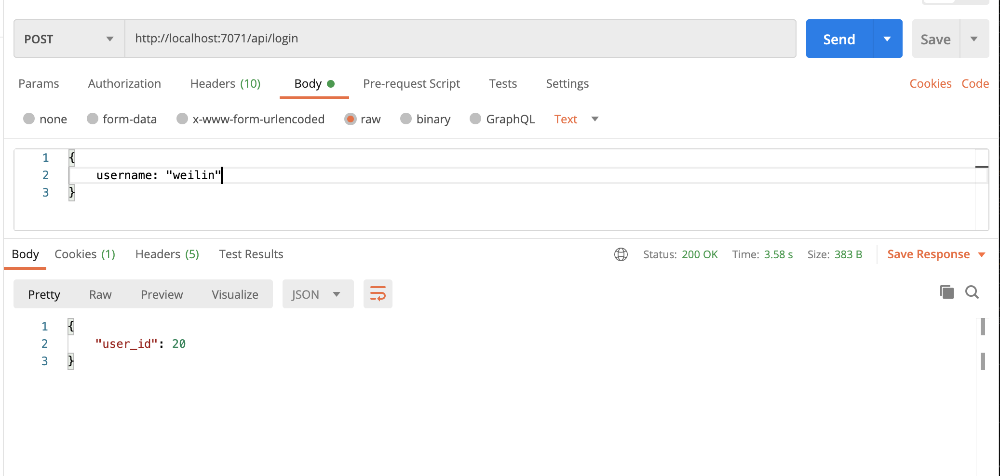

# Introduction 
The **Authentication Module** is responsible for authenticating/deauthenticating (i.e. logging in and logging out) a user. It also is responsible for storing user credentials (currently a username and password); hence, the Authentication module (ideally) should be the only module interacting with the Credentials table in the class's PostgreSQL DB. 

## Solution Breakdown
- **`backend/Authentication/`**
    - A **solution** is a group of **projects** and is defined by a `.sln` file (`backend/Authentication/Authentication.sln`). 
    - The **Authentication solution** contains two projects: `Authentication` (the actual function app code), and `Authentication.Tests` (unit tests).
- **`backend/Authentication/Authentication/`**
    - The `Authentication` project is an Azure function app, and its functions can be invoked via HTTP requests as described in subsequent sections. This is the "actual" implementation of the Authentication Module's expected responsibilities ((de)authentication).
- **`backend/Authentication/Authentication.Tests/`**
    - The `Authentication.Tests` project is an xUnit test app created by following this [tutorial](https://docs.microsoft.com/en-us/azure/azure-functions/functions-test-a-function). It uses the `Moq` framework to mock the behavior of the PostgreSQL database.

# Endpoints
1. `/login`: Authenticate the user; validate the user's credentials against the database before sending back a JWT token embedded with user information (user_id, etc.)
2. `/logout`: Deauthenticate the user; invalidate the JWT token to prevent bad actors from potentially reusing it after the user logs out.

For more information on these endpoints, such as request/response format, see the [Main Project API](https://docs.google.com/document/u/1/d/12xewqMfwEyRLmEDf23RZmP7u43FwV7309qstAXApUSw/edit).

# Build and Run
There are two ways to run the Authentication function app locally.
## Visual Studio
1. Open the Authentication solution in Visual Studio (Open `backend/Authentication/Authentication.sln`). 
2. Update your app settings locally by adding the following environmental variables to `backend/Authentication/Authentication/local.settings.json`. To learn more, read [Microsoft Docs](https://docs.microsoft.com/en-us/azure/azure-functions/functions-dotnet-class-library?tabs=v2%2Ccmd#environment-variables).
```
    "JWT_SECRET_KEY": "XXX",
    "DB_USER": "XXX",
    "DB_NAME": "XX",
    "DB_PORT": "XXXX",
    "DB_PASSWORD": "XXX",
    "DB_HOST": "XX",
    "AUTH_AES256_KEY": "XX",
    "AUTH_AES256_IV": "XX"
```
At the end, your `local.settings.json` file should look like so:
```
{
    ...
    "Values": {
        ...
        "JWT_SECRET_KEY": "XXX",
        "DB_USER": "XXX",
        "DB_NAME": "XX",
        "DB_PORT": "XXXX",
        "DB_PASSWORD": "XXX",
        "DB_HOST": "XX",
        "AUTH_AES256_KEY": "XX",
        "AUTH_AES256_IV": "XX"
      ...
    }
}
```
For an example `local.settings.json` file with the actual strings, see [HERE](https://docs.google.com/document/d/1S7zNXG8oSXmgGPoXYGBhGaOrKz-gJpsgRqvoTCJq2EM/edit#heading=h.vk8faeenel5t).

3. To start the function app locally, press the play button on the top left button, or press `Run > Start Debugging`. (`Run > Start Without Debugging` should also work.)
4. The console should list the function endpoints available to invoke via an HTTP request, like so.

5. The easiest way to call the endpoints would be through Postman. 


## Terminal
If you have edited your `local.settings.json` file as described in the previous `Visual Studio` section, you can skip to step 2 and just run `func start --build`.
1. Open the terminal and follow the instructions in [Supporting Dev/Prod Configurations](https://docs.google.com/document/d/13Nr3LMvaGWnZDy4Ml3qSfRj_WOOqy3JVxwGZzPo63CQ/edit#heading=h.r4t95qeccwvx) to add `DB_HOST`, `DB_NAME`, `DB_PASSWORD`, `DB_PORT`, `DB_USER`, `JWT_SECRET_KEY`, `AUTH_AES256_KEY`, `AUTH_AES256_IV` variables to your local environment.
2. In the same terminal, `cd` to the `Authentication` *project* (`backend/Authentication/Authentication` folder), then run the following command: 
    ```
    func start --build
    ```
    You will need to have [Azure Functions Core Tools](https://github.com/Azure/azure-functions-core-tools#installing) installed beforehand.
3. After building the app, the terminal should then list the function endpoints like described in step 4 of [Visual Studio](#visual-studio) instructions.

# Test
## Visual Studio (WINDOWS ONLY)
1. Follow these [instructions](https://docs.microsoft.com/en-us/visualstudio/test/configure-unit-tests-by-using-a-dot-runsettings-file?view=vs-2019#specify-a-run-settings-file-in-the-ide) for setting up environment variables for unit testing. These instructions ONLY work for WINDOWS machines.
2. Open the Authentication solution - follow step 1 in [Visual Studio](#visual-studio) section of [Build and Run](#build-and-run).
3. To run ALL unit tests, press `Run > Run Unit Tests`. 
4. To run specific tests, you can also press `View > Tests`, and a sidebar will appear with the tests listed for you to run individually.
5. Test results will appear in another window in Visual Studio like so.


To learn more about running unit tests, see [Microsoft Documentation](https://docs.microsoft.com/en-us/visualstudio/test/getting-started-with-unit-testing?view=vs-2019&tabs=mstest).

## Terminal
1. Open the terminal and follow the instructions in [Supporting Dev/Prod Configurations](https://docs.google.com/document/d/13Nr3LMvaGWnZDy4Ml3qSfRj_WOOqy3JVxwGZzPo63CQ/edit#heading=h.r4t95qeccwvx) to add `DB_HOST`, `DB_NAME`, `DB_PASSWORD`, `DB_PORT`, `DB_USER`, `JWT_SECRET_KEY`, `AUTH_AES256_KEY`, `AUTH_AES256_IV` variables to your local environment.
2. In the same terminal, `cd` to the `Authentication.Tests` *project* (`backend/Authentication/Authentication.Tests` folder), then run the following command: 
    ```
    dotnet test
    ```
    For more information, see the [xUnit documentation](https://xunit.net/docs/getting-started/netcore/cmdline).
3. If you want to combine steps 1 and 2, you can write a script that will both set the environment variables and run the test app at once. An example script containing the actual strings can be found [HERE](https://docs.google.com/document/d/1S7zNXG8oSXmgGPoXYGBhGaOrKz-gJpsgRqvoTCJq2EM/edit#heading=h.38sdkikzsp2f).


# Contributers (Auth Gang 🔐🔥🤪)
- Angela Hwang
- Jamie Tan
- Thanh Vu

If you want to learn more about creating good readme files then refer the following [guidelines](https://docs.microsoft.com/en-us/azure/devops/repos/git/create-a-readme?view=azure-devops). You can also seek inspiration from the below readme files:
- [ASP.NET Core](https://github.com/aspnet/Home)
- [Visual Studio Code](https://github.com/Microsoft/vscode)
- [Chakra Core](https://github.com/Microsoft/ChakraCore)